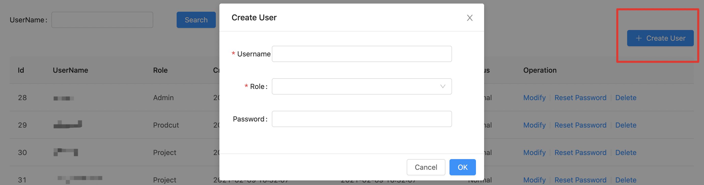
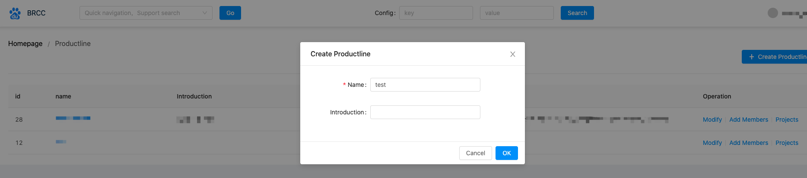
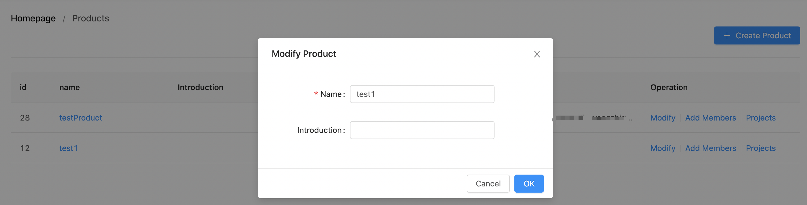
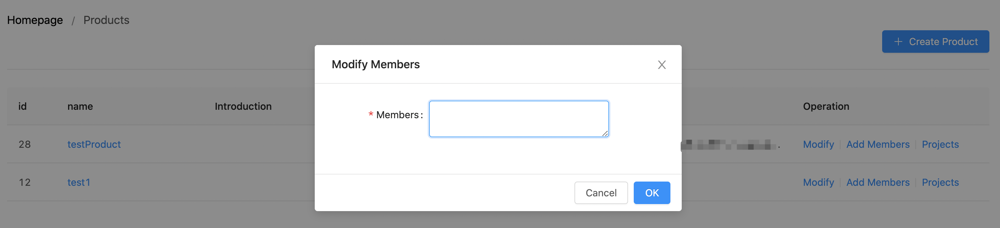
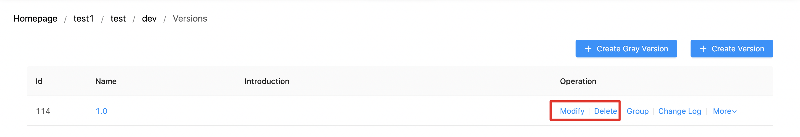
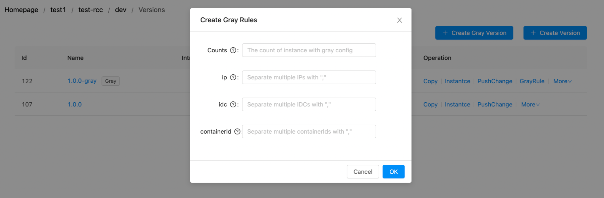
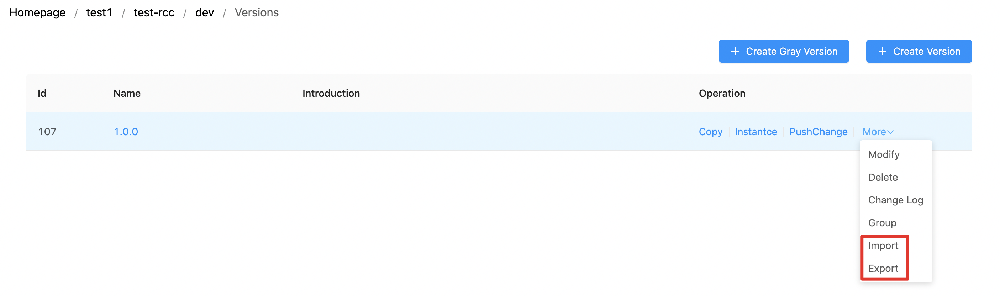
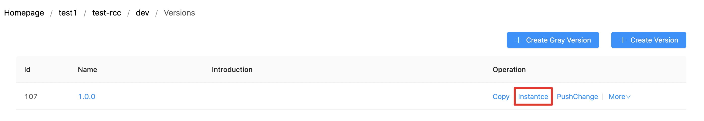
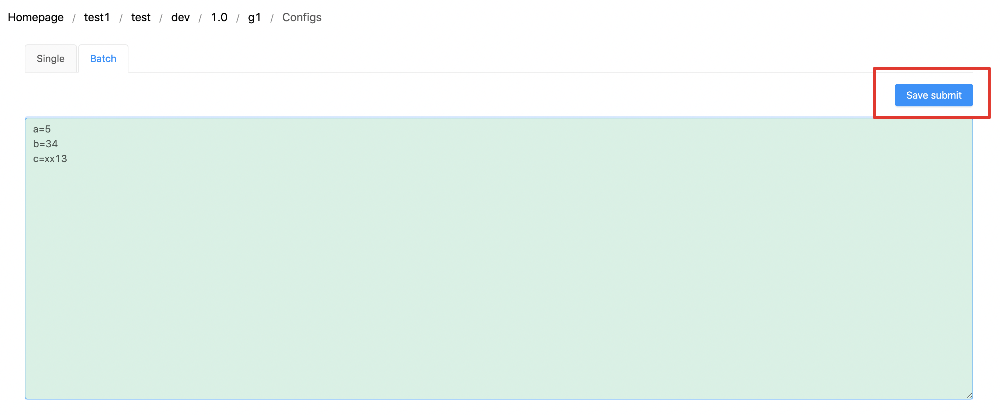

# Console Guide

# 1.Account

## 1.1 Login

URL: http://ip:port/#/login

- *\*You can contact us to get system admin account*

## 1.2 Account Management

- System Administrator
  
- Entrance
  

- Management

- Create User

- Reset Password

a. Profile(Reset Password)

b. User Management(System Administrator)

# 2. Configuration Management

## 2.1 Product Management
  

- Create Product(System Administrator)
  

- Modify Product(System Administrator)
 

- Add Product Administrator(System Administrator)

## 2.2 Project Management

- Project Modify

- Authority Management

---

- Reset ApiPassword

## 2.3 Environment Management

## 2.3 Version Management

- Version Modify

- Copy Version

- Push Version

- Change Log(Support recovery)

- Configure Grayscale Publish(Restart)

- Set Gray Rule
  

- Configuration Import/Export(properties)

- Instance Management

## 2.4 Group Management

## 2.5 Configuration Management

- Single

- Batch

- Configuration Search
  

- Quick search

