# 管理端使用手册

# 一、账号相关

## 1.1 账号登录

访问 http://ip:port/#/login

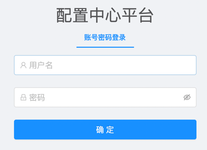

- *\*初始安装的超管账号和密码联系群管理员获取（备注：安全要求）*

## 1.2 账号管理

- 需要系统管理员权限
  
- 入口
  
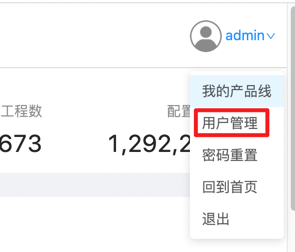

- 管理界面

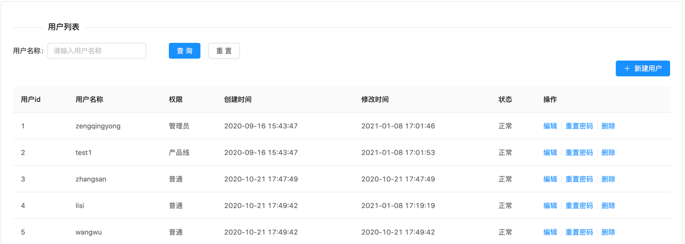

- 新增用户

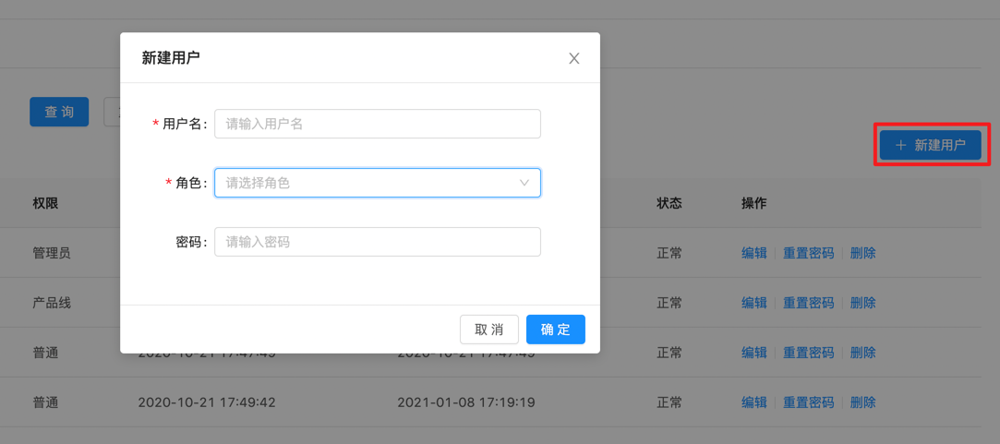

- 重置密码

密码重置有2个入口

a. 个人信息菜单下拉 (所有用户，重置自己的密码)

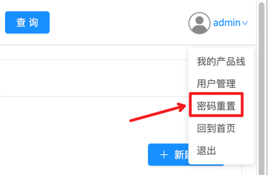

b. 用户管理界面 (管理员用户，重置指定用户的密码)

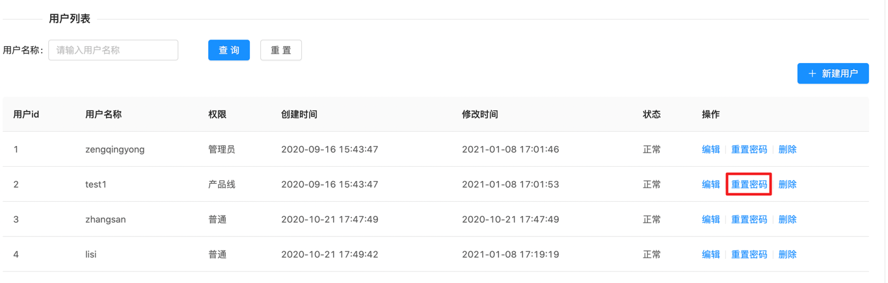

# 2. 配置管理

## 2.1 产品线管理

- 产品线入口， 产品线入口有3个，首页中的【全部产品线】、具体产品，个人信息菜单下拉框中的【我的产品线】如下图：
  
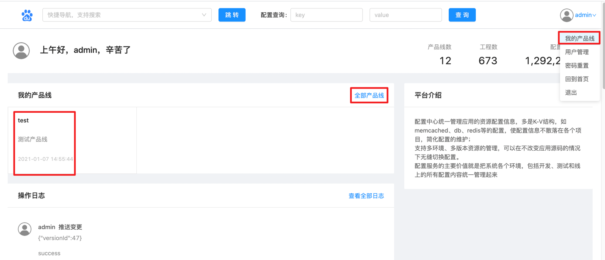

- 新建产品线(系统管理员权限)
  
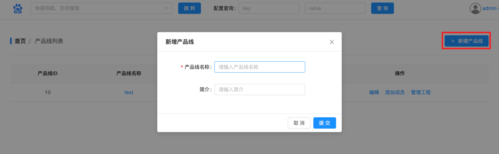

- 编辑产品线(系统管理员权限)
 
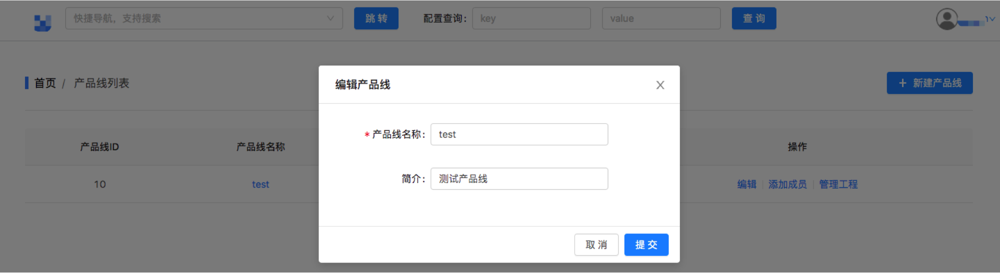

- 添加产品线管理员(系统管理员权限)

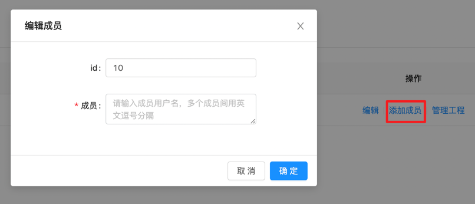

## 2.2 工程管理

- 工程的新增，删除，编辑管理

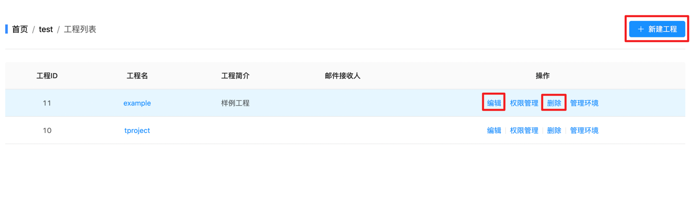

- 工程权限管理

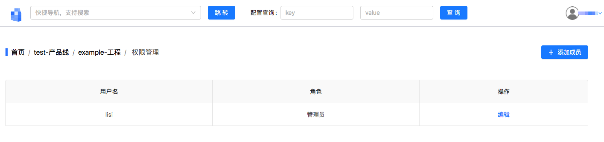

---

- 重置工程的api密码(系统管理员、产品线管理员权限)

## 2.3 环境管理

## 2.3 版本管理

- 版本的新增，删除，编辑

- 版本复制（实现将指定版本的所有配置同步到当前版本）

- 版本推送（当版本下的配置发送变化后，执行版本推送，sdk端将会获取变化的配置）

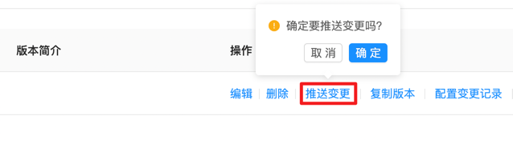

- 版本配置变更记录（查询当前版本的历史变更记录，可以根据需要对配置操作进行恢复）

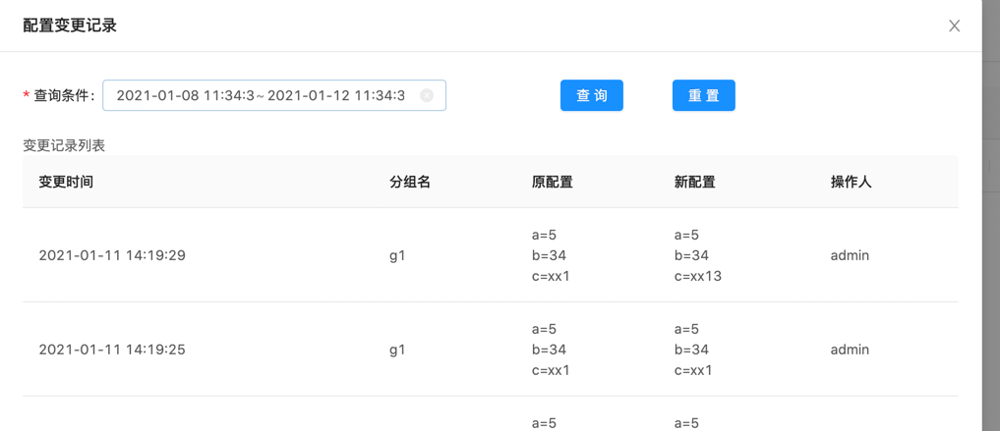

- 配置灰度发布(新建灰度版本，重启后灰度配置生效)

- 设置灰度规则
  

- 配置导入导出（支持properties格式的配置文件导入导出）

- 实例管理

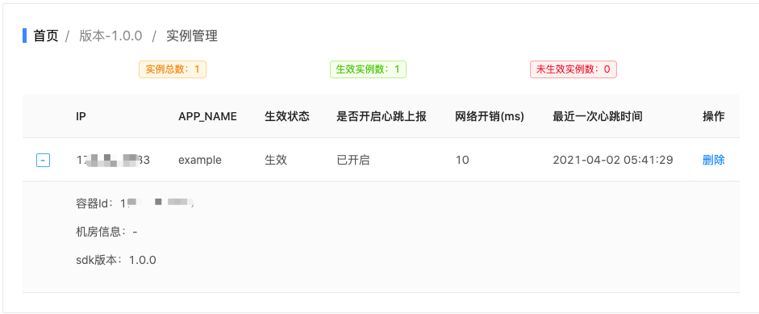

## 2.4 分组管理

## 2.5 配置管理

- 配置管理逐条维护

- 配置管理批量维护

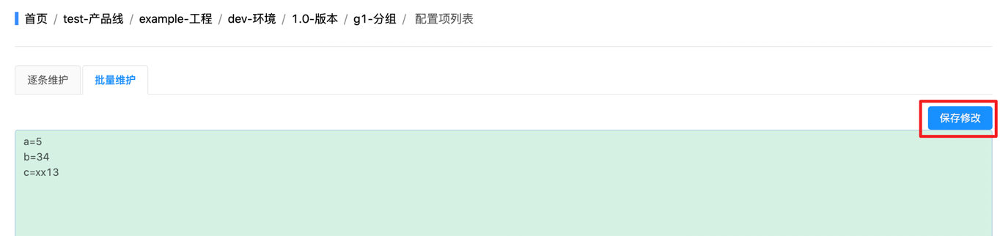

- 配置管理全局查询
  
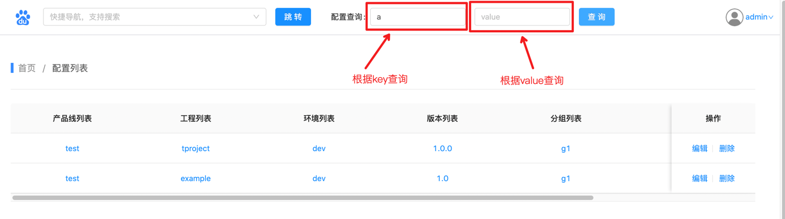

- 快速导航

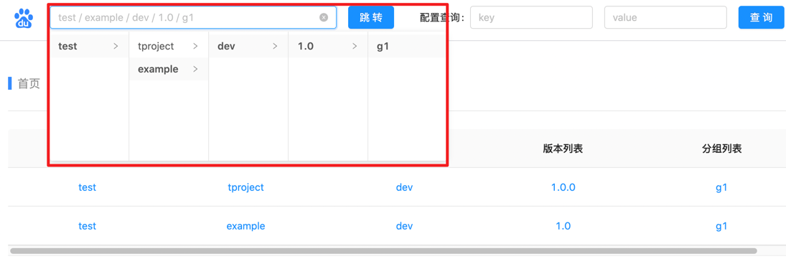
